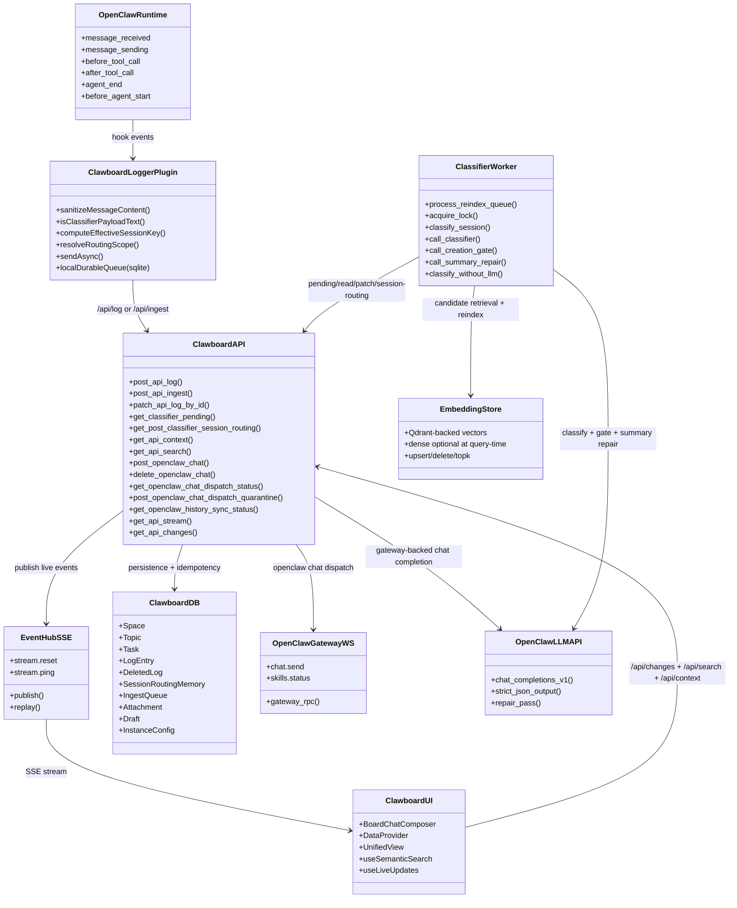
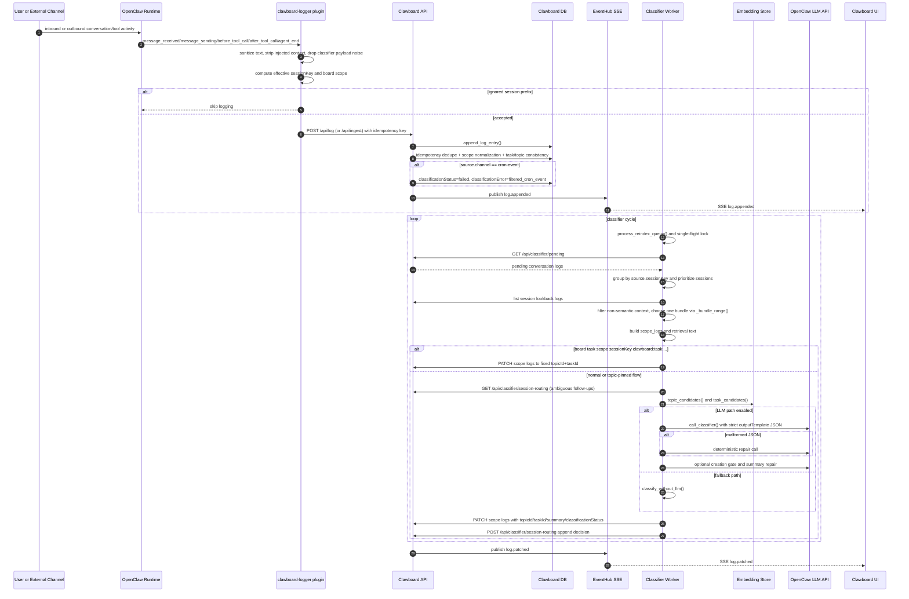
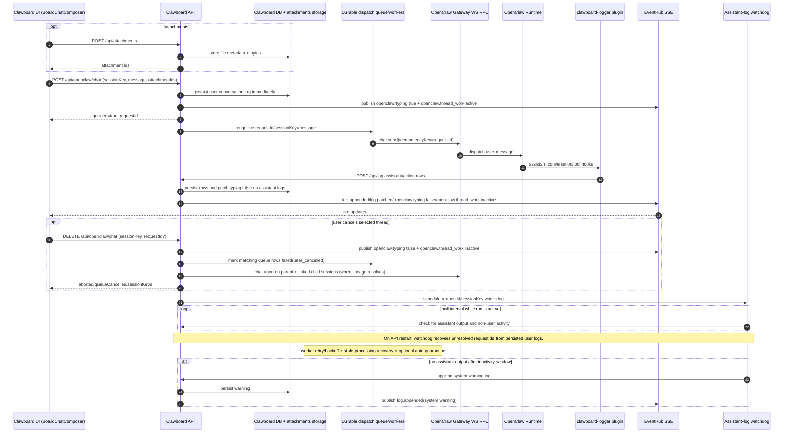
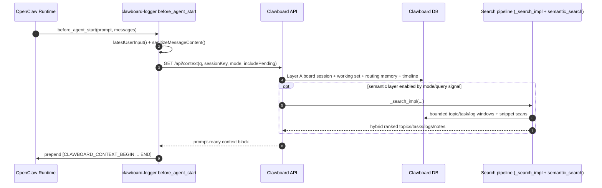
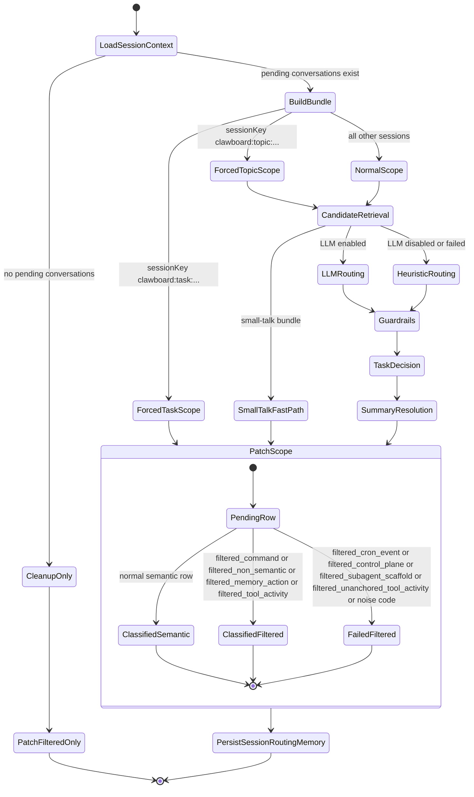
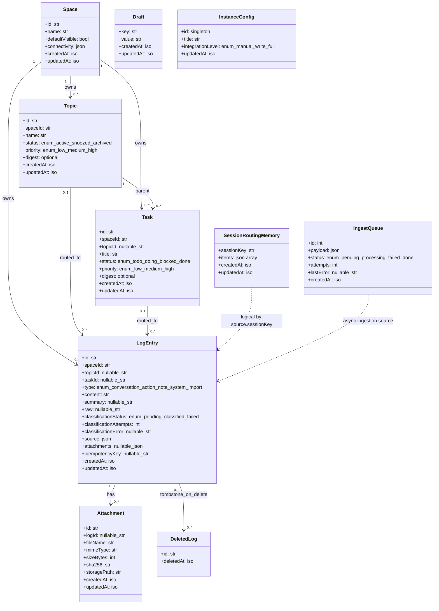

# OpenClaw <-> Clawboard Content System UML

This document models the full user-generated-content and LLM-content lifecycle between OpenClaw and Clawboard.

## 1) Component Topology (UML Class/Component View)

## 2) Offworld Ingestion + Classification Sequence

## 3) Board Chat Send/Return Sequence

## 4) Context Injection + Search Sequence

## 5) Classifier Decision State Machine (Per Bundle)

## 6) Persistence Model (UML Class Diagram)

